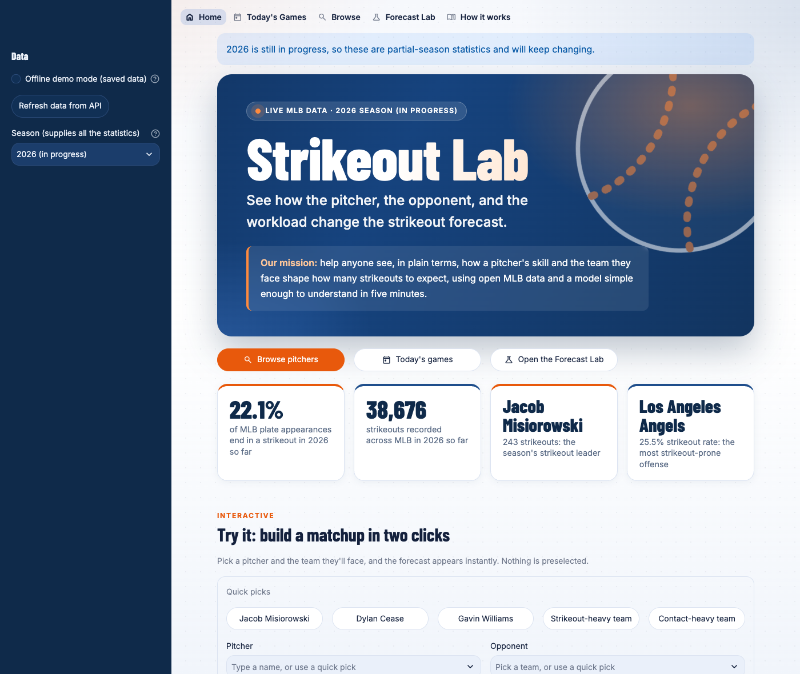
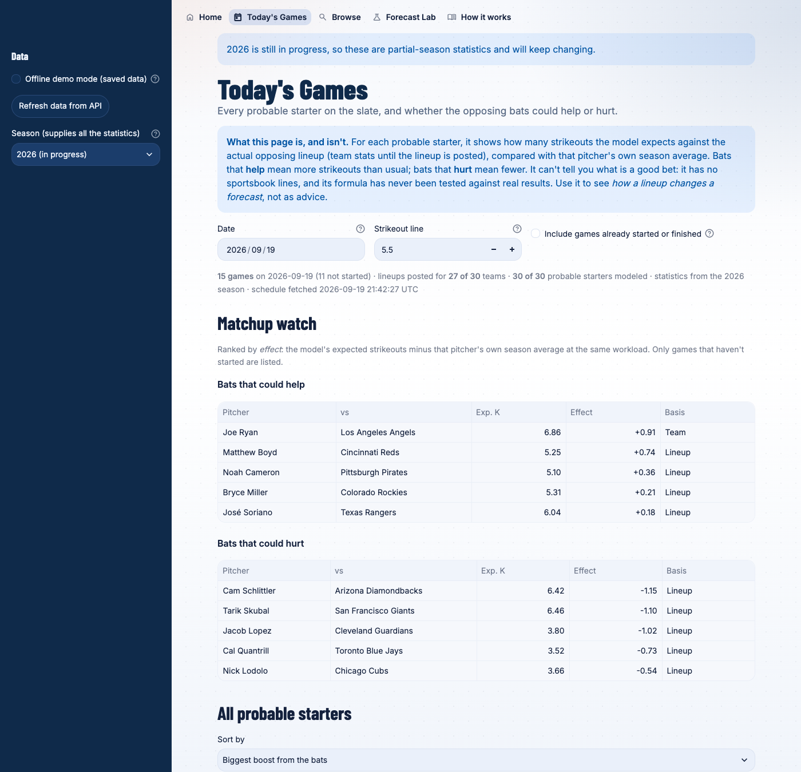
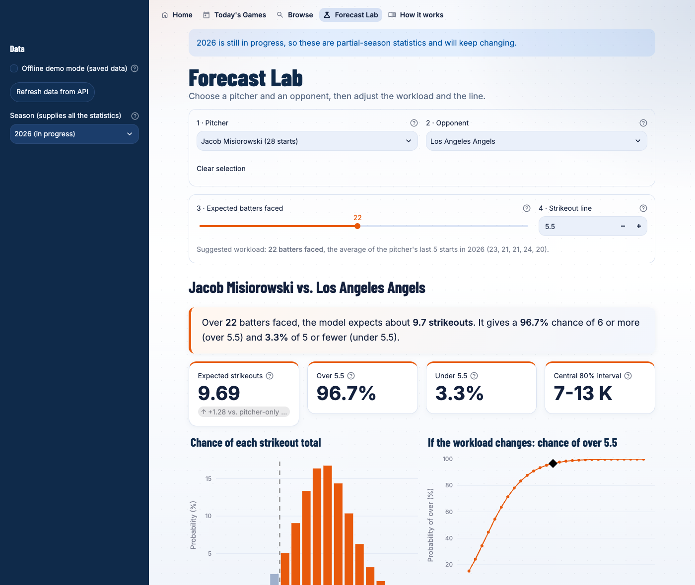

# Strikeout Lab

An interactive MLB pitcher strikeout explorer, built for CMU 15-113 "Explore an API."

**Our mission:** help anyone see, in plain terms, how a pitcher's skill and the team
they face shape how many strikeouts to expect, using open MLB data and a model simple
enough to understand in five minutes.

Browse the season's pitchers and teams, see today's games with each starter's forecast against the
actual opposing lineup, or pick any matchup and workload yourself. Strikeout
Lab estimates the **distribution** of strikeout totals and the probability of going
**over** or **under** a hypothetical line such as 5.5. The question it explores: *how do
the opponent and the pitcher's expected workload change the strikeout forecast?*

> **This is an educational statistical model, not a betting system.** It has not
> been validated or backtested, and it makes no claim of accuracy, profitability,
> or an advantage over sportsbooks. The "line" is purely hypothetical.

| Home | Today's Games |
|---|---|
|  |  |



## Install and run

Built and tested on Python 3.14 (other recent Python 3 versions should work but were not tested). From this folder:

```bash
python3 -m venv .venv
source .venv/bin/activate            # Windows: .venv\Scripts\activate
pip install -r requirements.txt
streamlit run app.py
```

Streamlit opens the app at <http://localhost:8501>. Leave that terminal open while
you use it, and press `Ctrl+C` to stop.

**No API key, account, subscription, or payment is needed** (there is nothing to buy or sign
up for anywhere in the app). If you have no internet, tick **Offline demo mode** in the
sidebar (see [Offline mode](#offline-mode)). Run the tests with `python -m pytest`.

## Deploying a public link

The app can be hosted for free on [Streamlit Community Cloud](https://share.streamlit.io), which gives it a
permanent `https://<name>.streamlit.app` address:

1. Sign in with GitHub, then choose **Create app**, then **Deploy a public app from GitHub**.
2. Repository `andrewjounkim/strikeout-lab`, branch `main`, main file `app.py`. Under *Advanced settings*, pick the
   newest Python version, and optionally a custom address such as `strikeout-lab`.
3. Deploy. Every push to `main` redeploys it, and it needs no secrets. Free apps go to sleep after a period of
   inactivity and wake with a click, so open the link once before showing it to anyone.

The app uses Eastern Time for MLB's day and game times (labeled "ET"), so it looks the same wherever it runs.

## Using the app

The navigation bar has five pages (on a phone, tap the `>>` arrow at the top left):

- **Home:** an animated banner with the mission statement, live league numbers, an interactive
  **"Try it"** matchup builder (quick picks, then a forecast appears right there), a live glimpse of
  today's slate, a leaders chart you can flip between pitchers and offenses, and the season's top strikeout
  pitchers. Everything on it is real MLB data.
- **Today's Games:** the day's schedule with every probable starter modeled against the **opposing
  lineup** once it's posted (team stats until then). A *Matchup watch* lists the pitchers the bats could
  **help** (more strikeouts than their own average) and **hurt** (fewer), and a table covers everyone; click a
  row to see the nine batters behind it. It shows model outputs, **not bets**: see the note below.
- **Browse:** two tabs. *Pitchers* is a searchable, sortable table (search by name, filter by
  number of starts, sort by strikeouts or strikeout rate); *Teams* ranks every offense by how
  often it strikes out. Click a row, then send that pitcher or team to the Lab.
- **Forecast Lab:** four numbered steps: pitcher, opponent, expected batters faced, and a
  strikeout line. **Nothing is preselected**, so you never start on a matchup you didn't
  choose. Results appear once you've chosen a pitcher and an opponent. There is also a
  clearly labeled "Just show me an example" button.
- **How it works:** the model, what each number means, the assumptions, and the data,
  in plain English.

The **season** selector and **Offline demo mode** are in the sidebar ("Data"), and your
choices are remembered as you move between pages.

## How the API is called

The app uses Python's `requests` library to send HTTP `GET` requests to the public
MLB Stats API (`https://statsapi.mlb.com/api/v1`), which needs no API key or login.
Six endpoints are used (`/seasons/all`, `/teams/stats`, `/stats` for pitchers and for batters,
`/people/{id}/stats`, and `/schedule`), with query parameters such as `season=2026`,
`group=hitting` or `pitching`, `stats=season` or `gameLog`, `playerPool=All`, and
`date=YYYY-MM-DD` with `hydrate=probablePitcher,lineups` that choose the year, the day, and which statistics
come back. Each response is JSON: a
nested dictionary where `stats[0].splits` is a list of rows and each row's `stat`
holds numbers such as `strikeOuts`, `plateAppearances`, `battersFaced`, and
`gamesStarted`. The code reshapes those rows into plain Python lists, refuses to
continue if data is empty or missing (it never fills in made-up numbers), and
Streamlit caches every response so moving a slider sends no new requests.
Exact endpoints, fields, and what I verified are in [API_NOTES.md](API_NOTES.md).

## APIs used

**One data API: the MLB Stats API** (`https://statsapi.mlb.com/api/v1`). It is free and public, and it needs **no API key,
account, or login**. The app makes plain HTTP `GET` requests to six of its endpoints:

| Endpoint | What it gives us | Used for |
|---|---|---|
| `/seasons/all` | Every season with its start and end dates | Finding the current and last completed season |
| `/teams/stats` (hitting) | Each team's batting strikeouts and plate appearances | Opponent rates and the league average |
| `/stats` (pitching) | Every pitcher's strikeouts, batters faced, starts | The pitcher selectors and pitcher rates |
| `/stats` (hitting) | Every batter's strikeouts and plate appearances | Rating a posted lineup on the Today page |
| `/people/{id}/stats` (gameLog) | One pitcher's game-by-game batters faced | The default workload (last five starts) |
| `/schedule` (probablePitcher, lineups) | A day's games, probable starters, posted lineups | The Today page and the home page's slate card |

Other things you might be asked about:

- **Python libraries are not APIs.** `requests` (sends the HTTP calls), `streamlit` (the web interface), `scipy` (the
  probability math) and `plotly` (the charts) are tools the code uses, not services it calls.
- **Google Fonts** was used **once, while building the design**, to download the two font files (Inter and Barlow
  Condensed, both open-licensed). They are stored in `static/fonts/`, so the running app never contacts Google.
- Nothing else is called. A test (`test_the_app_only_ever_contacts_the_mlb_stats_api`) fails if the code ever
  starts calling a second host.

## Secrets and API keys

There are **no secrets in this project**: the MLB Stats API is keyless, so nothing needs hiding. As a guard, the
repo was scanned for credentials, `.gitignore` excludes `.env`, `config.local`, and `secrets.toml`, and an automated
test fails if a key, token, or password-like assignment ever appears in any file. If a keyed API is added later,
keep the key in an environment variable or in one of those ignored files, and read it in Python
(server-side); never put it in browser code or commit it. If one is ever committed by accident, revoke it at the
provider immediately, because deleting it in a later commit does not remove it from git history.

## How the model works

Three strikeout rates, each computed from **raw counts**:

```
pitcher_rate  = pitcher strikeouts / pitcher batters faced
opponent_rate = opponent batting strikeouts / opponent plate appearances
league_rate   = total MLB batting strikeouts / total MLB plate appearances
```

The league rate adds up the raw counts of all 30 teams (not an average of their
percentages), so teams with more plate appearances count for more.

A simple matchup adjustment gives the per-batter strikeout probability:

```
p_raw = pitcher_rate * (opponent_rate / league_rate)
p     = clamp(p_raw, 0.01, 0.60)
```

A strikeout-heavy opponent (ratio above 1) raises `p`; a contact-heavy one lowers
it. If clamping ever happens, the app shows a notice. Then, for the N batters you
choose, the strikeout total is modeled as **K ~ Binomial(N, p)**, like flipping a
weighted coin N times. From that distribution the app reports:

- **Expected strikeouts** = N x p, next to a **pitcher-only baseline**
  (N x pitcher_rate) so you can see what the opponent adjustment changed
- **Probability of every total** from 0 through N (bar chart)
- **Over / under** a half-integer line. For 5.5, "over" means K >= 6 and "under"
  means K <= 5, so the two always add to 100% with no ties
- A **central 80% model prediction interval** (10th to 90th percentile of the
  model's distribution; because strikeouts are whole numbers it covers a bit more
  than 80%, and the app shows the exact coverage)
- A **workload sensitivity chart**: P(over) if the pitcher faces 9 to 36 batters.
  It shows alternative assumptions, not a confidence interval.

**Worked example** (2025 data, fetched 2026-09-19): Garrett Crochet, 255 K in 814
batters faced (0.3133), against Arizona, 1,316 K in 6,210 plate appearances (0.2119),
with a league rate of 0.2222 gives `p = 0.3133 x (0.2119 / 0.2222) = 0.2988`. At
25 batters faced that is 7.47 expected strikeouts (7.83 for the pitcher alone) and
an 80.3% chance of going over 5.5.

**Today's games and the batters.** On the Today page the opponent rate comes from the nine batters in the
posted lineup: their season strikeouts and plate appearances are **added up** across the lineup (not
averaged), so a regular with 600 plate appearances counts for more than a bench bat with 40. A lineup is used
only if at least 7 of its batters have stats; otherwise, or if no lineup is posted yet, the team's rate is used
and the row says so. The *effect of the bats* is the model's expected strikeouts minus that pitcher's own
season average at the same workload. A pitcher with no starts yet, or no announced starter, is listed as not
modeled with the reason. **This is not a "who to bet on" list:** the model has no sportsbook lines, and its
formula has never been tested against real results, so it can show how a lineup changes a forecast but not
whether any line is mispriced.

**Workload.** The slider defaults to the average batters faced over the pitcher's
last five *starts* that season (relief appearances are filtered out), and the app
shows those starts and the sample size. If no game log is available it uses a
**manual assumption of 24 batters faced and labels it as not derived from the API.**
The model uses batters faced, never innings (baseball's `6.1` innings means 6 1/3,
not 6.1).

**Season.** You can pick a season; it supplies *every* statistic. The app opens on the **current
season (2026, still in progress)**, so its numbers are partial and change as games are played (the
app says so). Pick 2025 or earlier in the sidebar for complete, final numbers. The 60-game 2020
season and every year back to 2016 also work.

## Assumptions and limitations

- **Fixed workload.** Real pitchers get pulled early or go deep depending on the game.
- **Independent, identical batters.** A binomial model assumes every plate appearance
  has the same strikeout probability, independent of the rest.
- **The matchup formula and the 1%-60% bounds are assumptions**, chosen because they
  are easy to explain. They were not fitted to data or validated.
- **Team-level opponent stats** in the Forecast Lab describe the whole team's season, not the confirmed
  lineup, and include players who may have since left. The Today page uses the posted lineup's season
  totals instead, which still ignore batting order, left/right matchups, rest days, and late lineup changes.
  Probable pitchers can change before first pitch.
- **Season statistics, not projections.** No shrinkage for small samples, and no
  ballpark, weather, umpire, injury, handedness, or pitch-level information. The app
  flags pitchers with fewer than 100 batters faced as small samples.
- **No backtest.** Nothing here is evidence of predictive accuracy.

## Data limitations

- The MLB Stats API is public but not formally documented for this use, so fields
  could change.
- The current season is still in progress, so its statistics are partial and will keep changing
  (data is cached for 6 hours; the **Refresh data** button fetches it again). Older seasons work,
  but 2020 was a 60-game season (small samples). The app says so for both.
- In the real 2025 data, no starter against any team triggers the 1%-60% clamp, so
  it is a rarely-used safety rail rather than a routine adjustment.
- For pitchers who changed teams, the API's combined season row is used as-is
  (verified against their per-team lines). See [API_NOTES.md](API_NOTES.md).

## Offline mode

`data/offline_snapshot_2026.json` and `data/offline_snapshot_2025.json` are small saved extracts of
**real** API responses (team batting, every pitcher with a start, and game logs for a set of pitchers; the
2026 one also holds every batter's totals and the slate saved on the day it was made, which is what the
offline Today page shows),
with each source URL and fetch time recorded. Tick **Offline demo mode** to use them (it opens on
2026, and you can switch to 2025 in the sidebar); the app then shows a prominent "OFFLINE DEMO
MODE" banner, and a partial-season snapshot is still labeled as in progress. Pitchers without a saved
game log fall back to the labeled manual 24-batter default. Rebuild or refresh one any time with
`python make_snapshot.py 2026`. The app never switches to offline mode by itself: if the
API is unreachable it shows an error and suggests the toggle.

## Project layout

```
app.py             Entry point: page setup, then the navigation bar
navigation.py      Builds the five pages
context.py         Loads and caches the season's data; draws the sidebar "Data" controls
state.py           What the app remembers as you move between pages
views/             One file per page: home.py, today.py, browse.py, lab.py, about.py
slate.py           Today's games: per-pitcher forecasts from the posted lineups (pure logic)
charts.py          The two Plotly charts on the Forecast Lab page
ui.py              Styling (background, cards, animations) and the hero banner
static/fonts/      Inter and Barlow Condensed (open-licensed, with their license files)
model.py           The probability math. No network, no Streamlit.
api.py             MLB Stats API requests and parsing, with clear error messages
make_snapshot.py   Builds the offline snapshot from the live API
data/              Offline snapshots for 2025 and 2026 (real API data, with sources and times)
tests/             162 tests; tests/fixtures/ holds trimmed real API responses
.streamlit/        Theme (fonts, colors, sidebar) and settings that hide Streamlit's Deploy button
API_NOTES.md       Endpoints, parameters, fields, and what was verified
prompt_log.md      AI tools used and the prompts that shaped the project
```

## Testing

`python -m pytest` runs 162 tests. They need no internet (the suite was also run with every
outbound network connection blocked, and passes). They cover the model math
(probabilities sum to 1, half-integer over/under, a league-average opponent leaving the
pitcher's rate unchanged, missing and zero-denominator inputs), the API parsing against
real saved responses (traded pitchers appear once with combined totals, relief outings are
filtered out, empty/bad responses become clear errors), and the pages themselves through
Streamlit's headless test runner (the Lab starts empty with no preselected pitcher, results
wait for an opponent, the slider, invalid lines, small-sample and clamp notices, the manual
workload label, offline mode, and unreachable-API behavior).
To check the tests can actually fail, I broke the code on purpose twenty-seven different ways
(for example: an off-by-one over/under threshold, averaged percentages, an inverted matchup
ratio, a Lab that preselects a pitcher, an app that opens on the wrong season, a Today page that ignores
posted lineups, one that ranks games already underway, a planted API key, a missing font file, a second API host, and a clock that ignores Eastern Time) and each one was caught. The app was also run
against the live API for all 11 selectable seasons (2016 to 2026) and used in a real Chrome browser
(desktop and phone width).

## Credits

- Data: the public [MLB Stats API](https://statsapi.mlb.com/api/v1).
- Fonts: [Inter](https://github.com/rsms/inter) and [Barlow Condensed](https://github.com/jpt/barlow), both under the
  SIL Open Font License (license files are in `static/fonts/`).
- Built with Claude (Anthropic) as a coding partner; see [prompt_log.md](prompt_log.md).

## Demo video outline (about 2-3 minutes)

1. **Intro (20 s):** what Strikeout Lab is and its mission; say it's an educational model, not a betting system.
   On the home page, point out the live numbers and try the **Try it** widget: pick a pitcher, then flip between the
   strikeout-heavy and contact-heavy team and watch the forecast move.
2. **The API (30 s):** say it's one API, the free MLB Stats API with no key (see "APIs used"); show `api.py`
   and one real request in the browser or terminal (e.g. the `/teams/stats` URL from API_NOTES.md); point at
   `strikeOuts` and `plateAppearances` in the JSON.
3. **Today's games (30 s):** open the Today page; read the note on what it is and isn't; show the matchup
   watch (bats that help vs. hurt), click a pitcher to see the actual lineup batter by batter, and point out
   "Not posted yet" for a team whose lineup isn't out.
4. **Browse (25 s):** on the Home page click a top pitcher, or open Browse, search a name,
   sort by strikeout rate, and flip to the Teams tab to show who strikes out most.
5. **Forecast Lab (45 s):** choose an opponent; explain the workload default (last five starts);
   drag the slider and show the forecast and charts change; set a line such as 5.5 and read
   over/under; switch to a league-average opponent to show the adjustment goes to zero.
6. **How it works (25 s):** open "How this model works" under the results; walk through the three
   rates, the matchup formula, and the pitcher-only baseline.
7. **Try to break it (15 s):** type a non-half-integer line (5), pick a small-sample pitcher, and tick Offline demo mode.
8. **Wrap-up (10 s):** limitations, and what you'd add next (lineups, backtesting).

## Portfolio description (adapt as you like)

> **Strikeout Lab** is an interactive Python web app that helps people explore and model
> MLB pitcher strikeouts. It pulls live team and pitcher statistics from the public MLB
> Stats API, lets you browse and search the season's pitchers and teams, then uses a
> transparent binomial model to estimate the distribution of strikeouts for a chosen
> pitcher, opponent, and workload, and the probability of going over a hypothetical line. A daily
> "Today's Games" view pulls the live schedule and posted lineups to show which pitchers the opposing
> batters could help or hurt.
> Built with Streamlit, scipy, and Plotly, with caching, error handling, an offline demo
> mode, and an automated test suite. It's an educational statistics project, not a betting
> tool, and the app spells out its assumptions and limits. (Python - Streamlit - REST API - probability)
